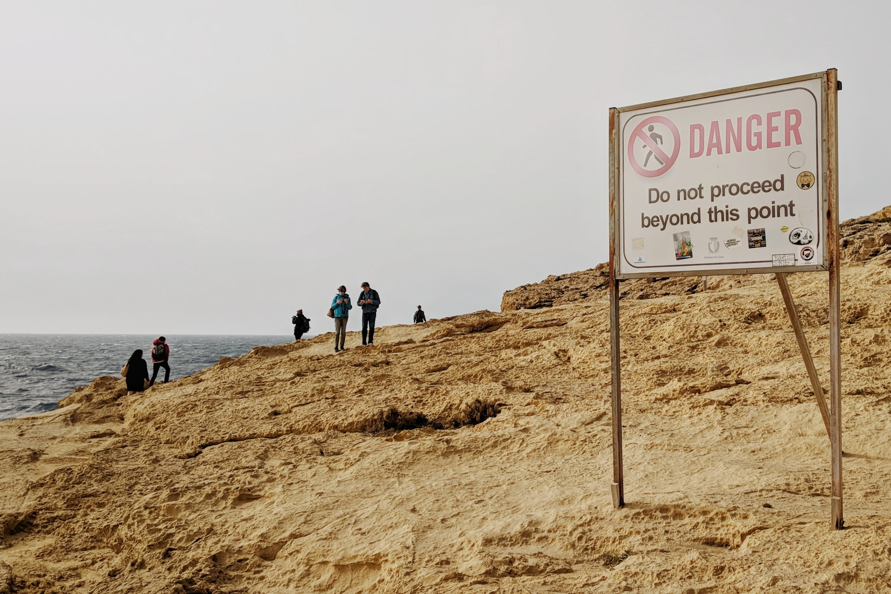
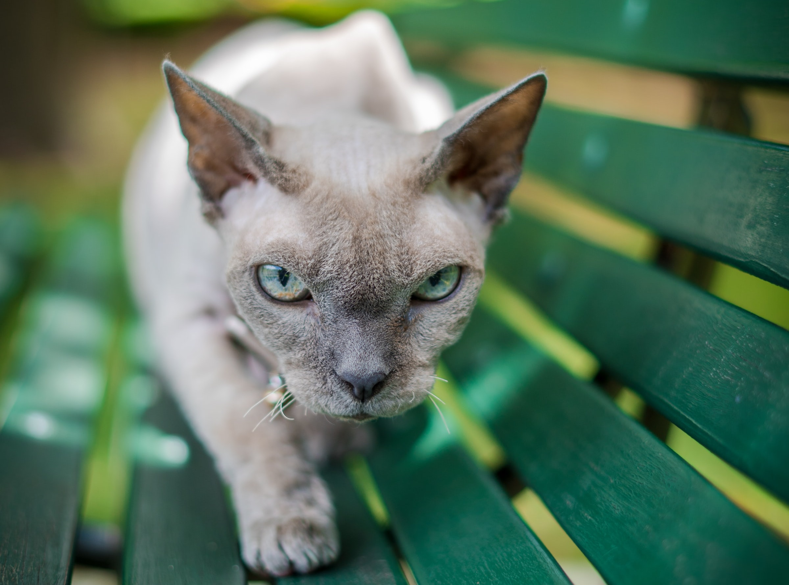

```{r setup, include=FALSE}
usethis::use_git_ignore(c("*.csv", "*.rds"))
options(htmltools.dir.version = FALSE)

#titleSlideClass: [inverse, center, middle]
#"default", "metropolis", "metropolis-fonts", 

# see options for customize slides: 
# https://slides.yihui.name/xaringan/
# https://slides.yihui.name/xaringan/incremental.html
# https://github.com/yihui/xaringan/wiki

library(knitr)
library(tidyverse)
library(xaringan)
```

class: inverse, center, middle

# Slides

[bretsw.github.io/manhattanville-lecture/](https://bretsw.github.io/manhattanville-lecture/)

---

class: inverse, center, middle

# Cases

```{r, out.width = "720px", echo = FALSE, fig.align = "center"}

```

---

# Case #1

### Twitter Chats

```{r, out.width = "240px", echo = FALSE, fig.align = "center"}
include_graphics("img/hashtag.jpg")
```

--

- There are 900+ education-related Twitter chats (https://archive.participate.com/)

--

- Most of these have a synchronous, one-hour window each week with moderated questions

--

- Bigger is (often) not better (#Edchat gets 5,000 tweets/day and heavy self-promotion)

--

- Recommended: state education hashtags (#michED, #nyedchat), subject specific (#NGSSchat, #sschat), #PSTPLN

---

# Case #2

### Teaching-related subreddits

```{r, out.width = "720px", echo = FALSE, fig.align = "center"}
include_graphics("img/reddit-example.jpg")
```

--

- Differences from Twitter: subreddits, threading, voting, anonymity

---

# Case #3

### New teachers

```{r, out.width = "480px", echo = FALSE, fig.align = "center"}
include_graphics("img/teacher.jpg")
```

--

- Everything is new, some induction supports already offered

--

- Must decide what's useful, what gaps remain, how/where to look

--

- Desire to maintain personal-professional boundaries

---

class: inverse, center, middle

# Frameworks

```{r, out.width = "720px", echo = FALSE, fig.align = "center"}
include_graphics("img/streetlamp.jpg")
```

---

# Affinity Spaces

```{r, out.width = "480px", echo = FALSE, fig.align = "center"}
include_graphics("img/empty-space.jpg")
```

--

- Generators

--

- Portals

--

- Content interactions

--

- Social interactions

--

- *Affinity spaces are basically the Room of Requirement from Harry Potter*

---

# Communities of Practive

```{r, out.width = "420px", echo = FALSE, fig.align = "center"}
include_graphics("img/community.jpg")
```

--

- Apprenticeship

--

- Shared identity

--

- Mutual engagement

--

- Legitimate peripheral participation

---

# Professional Learning Networks

```{r, out.width = "480px", echo = FALSE, fig.align = "center"}
include_graphics("img/network.jpg")
```

--

- Supports for professional learning

--

- Interpersonal connections

--

- Agency

---

# Learning Ecologies

```{r, out.width = "480px", echo = FALSE, fig.align = "center"}
include_graphics("img/many-worlds.jpg")
```

--

- Complementary components

--

- Ecological transitions: change over time

---

class: inverse, center, middle

# Cautions

```{r, out.width = "720px", echo = FALSE, fig.align = "center"}

```

---

# Two-worlds pitfall: 

### Many voices

```{r, out.width = "720px", echo = FALSE, fig.align = "center"}

```

---

# Local-global tension

```{r, out.width = "720px", echo = FALSE, fig.align = "center"}

```

(Contextualizing resources)

---

# Social comparison

```{r, out.width = "720px", echo = FALSE, fig.align = "center"}

```

---

# Quality

```{r, out.width = "720px", echo = FALSE, fig.align = "center"}

```

---

# Context collapse

```{r, out.width = "720px", echo = FALSE, fig.align = "center"}

```

---

# Harassment

```{r, out.width = "720px", echo = FALSE, fig.align = "center"}

```

---

class: inverse, center, middle

# Welcome to the good place?

```{r, out.width = "480px", echo = FALSE, fig.align = "center"}

```

**What do you think? Where do we go from here?**

---

# Questions?

```{r, out.width = "360px", echo = FALSE, fig.align = "center"}
include_graphics("img/question.jpg")
```

* **Email:** [staudtwi@msu.edu](mailto:staudtwi@msu.edu)

* **Web:** [bretsw.com](http://bretsw.com)

* **Twitter:** [@bretsw](https://twitter.com/bretsw)

* **GitHub:** [bretsw](https://github.com/bretsw)

* **Slides:** [bretsw.github.io/manhattanville-lecture/](https://bretsw.github.io/manhattanville-lecture/)